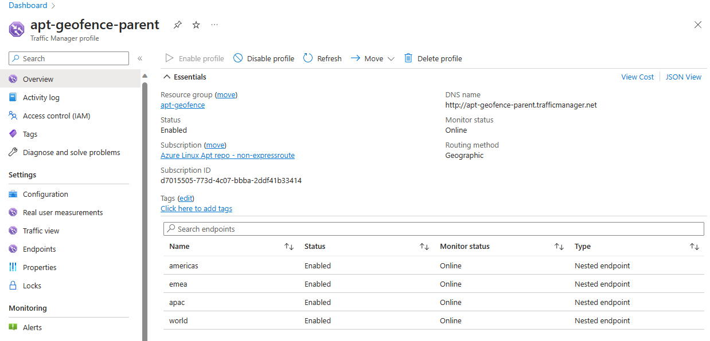
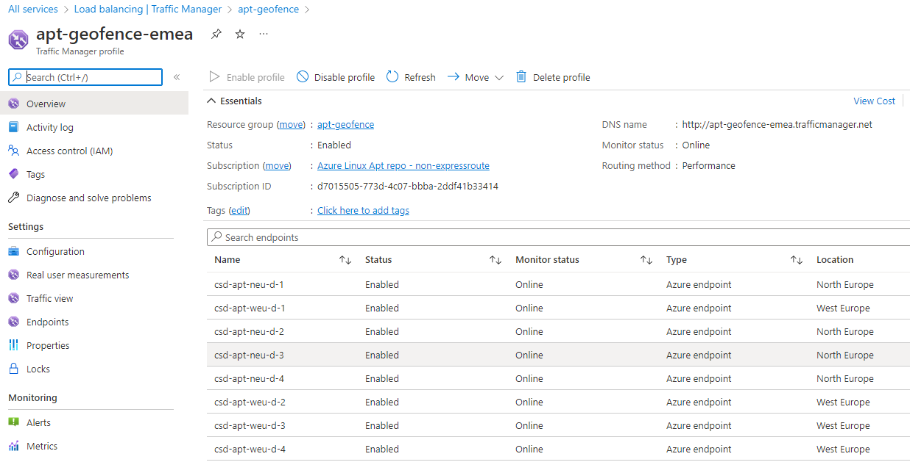
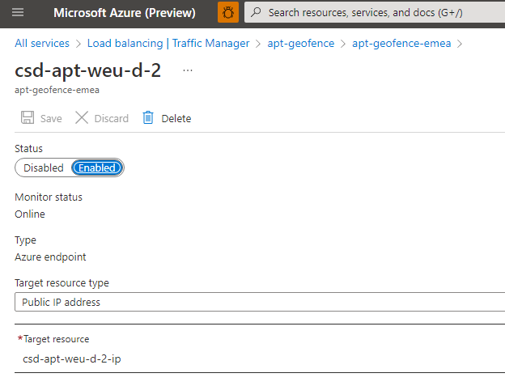

# Edge Cache Servers (a.k.a. mirrors)

PMC delivers content to users from a set of caching VMs deployed globally.
In the old (v3 and earlier) PMC architecture, each edge node contained a full mirror of all published repos.
In the v4 architecture, the edge nodes are reverse-proxy caches that contain recently-accessed packages.
PMC documentation refers to these servers as "edge servers", "edge caches", or "mirrors"; the terms are interchangeable.

Edge servers are exposed to the outside world through a set of super-regional traffic managers.
A given traffic manager balances traffic across the servers in one or more regions.
In general, an incoming request is routed to one of the servers in the region closest (BGP-wise) to the AS which owns the requesting IP address.
If none of the servers in that closest region are available, the traffic manager routes to some other server it's managing.

## Regions, Subscriptions, and Resource Groups

AAD Tenant: CORP (note: _not_ AME)  
Subscription name: [Azure Linux Apt repo - non-expressroute](https://ms.portal.azure.com/#@microsoft.onmicrosoft.com/resource/subscriptions/d7015505-773d-4c07-bbba-2ddf41b33414)  
Subscription ID: d7015505-773d-4c07-bbba-2ddf41b33414  
SAW Required? Only when JIT'ing for access

Edge cache servers are deployed in eight regions:
| Region | Location | Resource Group |
|--------|----------|----------------|
| eas | East Asia | [CSD-APT-EAS](https://ms.portal.azure.com/#@microsoft.onmicrosoft.com/resource/subscriptions/d7015505-773d-4c07-bbba-2ddf41b33414/resourceGroups/CSD-APT-EAS) |
| euap | EUAP in East US 2 | [csd-apt-eus2-euap](https://ms.portal.azure.com/#@microsoft.onmicrosoft.com/resource/subscriptions/d7015505-773d-4c07-bbba-2ddf41b33414/resourceGroups/csd-apt-eus2-euap) |
| eus | East US | [CSD-APT-EUS](https://ms.portal.azure.com/#@microsoft.onmicrosoft.com/resource/subscriptions/d7015505-773d-4c07-bbba-2ddf41b33414/resourceGroups/CSD-APT-EUS) |
| neu | North Europe | [CSD-APT-NEU](https://ms.portal.azure.com/#@microsoft.onmicrosoft.com/resource/subscriptions/d7015505-773d-4c07-bbba-2ddf41b33414/resourceGroups/CSD-APT-NEU) |
| sea | South East Asia | [CSD-APT-SEA](https://ms.portal.azure.com/#@microsoft.onmicrosoft.com/resource/subscriptions/d7015505-773d-4c07-bbba-2ddf41b33414/resourceGroups/CSD-APT-SEA) |
| sus | South US | [CSD-APT-SUS](https://ms.portal.azure.com/#@microsoft.onmicrosoft.com/resource/subscriptions/d7015505-773d-4c07-bbba-2ddf41b33414/resourceGroups/CSD-APT-SUS) |
| weu | West Europe | [CSD-APT-WEU](https://ms.portal.azure.com/#@microsoft.onmicrosoft.com/resource/subscriptions/d7015505-773d-4c07-bbba-2ddf41b33414/resourceGroups/CSD-APT-WEU) |
| wus | West US | [CSD-APT-WUS](https://ms.portal.azure.com/#@microsoft.onmicrosoft.com/resource/subscriptions/d7015505-773d-4c07-bbba-2ddf41b33414/resourceGroups/CSD-APT-WUS) |

The euap region is one of the Early User Access Program "canary" regions.
As such, services hosted there live on top of early access forms of Azure components, and customers opt-in to using services in that environment.
We use the euap region as our first test-in-production deployment target.

## Traffic Managers

The traffic managers belong to the [apt-geofence](https://ms.portal.azure.com/#@microsoft.onmicrosoft.com/resource/subscriptions/d7015505-773d-4c07-bbba-2ddf41b33414/resourceGroups/apt-geofence/overview) resource group in the [Azure Linux Apt repo - non-expressroute](https://ms.portal.azure.com/#@microsoft.onmicrosoft.com/resource/subscriptions/d7015505-773d-4c07-bbba-2ddf41b33414) subscription.

The top-level traffic manager, [apt-geofence-parent](https://ms.portal.azure.com/#@microsoft.onmicrosoft.com/resource/subscriptions/d7015505-773d-4c07-bbba-2ddf41b33414/resourceGroups/apt-geofence/providers/Microsoft.Network/trafficmanagerprofiles/apt-geofence-parent), is exposed under the DNS name http://apt-geofence-parent.trafficmanager.net.
Nested below it are super-regional traffic managers for [americas](https://ms.portal.azure.com/#@microsoft.onmicrosoft.com/resource/subscriptions/d7015505-773d-4c07-bbba-2ddf41b33414/resourceGroups/apt-geofence/providers/Microsoft.Network/trafficmanagerprofiles/apt-geofence-americas), [apac](https://ms.portal.azure.com/#@microsoft.onmicrosoft.com/resource/subscriptions/d7015505-773d-4c07-bbba-2ddf41b33414/resourceGroups/apt-geofence/providers/Microsoft.Network/trafficmanagerprofiles/apt-geofence-apac), and [emea](https://ms.portal.azure.com/#@microsoft.onmicrosoft.com/resource/subscriptions/d7015505-773d-4c07-bbba-2ddf41b33414/resourceGroups/apt-geofence/providers/Microsoft.Network/trafficmanagerprofiles/apt-geofence-emea).

The traffic managers are configured so that the regions within a super-region back each other up, and the global set of regions backup the super-regions.

The euap caches are handled by a separate traffic manager, [pmc-beta](https://ms.portal.azure.com/#@microsoft.onmicrosoft.com/resource/subscriptions/d7015505-773d-4c07-bbba-2ddf41b33414/resourceGroups/csd-apt-eus2-euap/providers/Microsoft.Network/trafficmanagerprofiles/pmc-beta/overview) exposed under the DNS name http://pmc-beta.trafficmanager.net.

## How to take a server out of rotation

1. Request Portal access via JiT (**SAW Required**) to the [Azure Linux Apt repo - non-expressroute](https://ms.portal.azure.com/#@microsoft.onmicrosoft.com/resource/subscriptions/d7015505-773d-4c07-bbba-2ddf41b33414) subscription (d7015505-773d-4c07-bbba-2ddf41b33414) in CORP AAD
1. Go to the [apt-geofence-parent](https://ms.portal.azure.com/#@microsoft.onmicrosoft.com/resource/subscriptions/d7015505-773d-4c07-bbba-2ddf41b33414/resourceGroups/apt-geofence/providers/Microsoft.Network/trafficmanagerprofiles/apt-geofence-parent) Traffic Manager geofence profile (SAW not required)
1. Select the geo-fence policy in which the VM resides ([americas](https://ms.portal.azure.com/#@microsoft.onmicrosoft.com/resource/subscriptions/d7015505-773d-4c07-bbba-2ddf41b33414/resourceGroups/apt-geofence/providers/Microsoft.Network/trafficmanagerprofiles/apt-geofence-americas), [emea](https://ms.portal.azure.com/#@microsoft.onmicrosoft.com/resource/subscriptions/d7015505-773d-4c07-bbba-2ddf41b33414/resourceGroups/apt-geofence/providers/Microsoft.Network/trafficmanagerprofiles/apt-geofence-emea), or [apac](https://ms.portal.azure.com/#@microsoft.onmicrosoft.com/resource/subscriptions/d7015505-773d-4c07-bbba-2ddf41b33414/resourceGroups/apt-geofence/providers/Microsoft.Network/trafficmanagerprofiles/apt-geofence-apac))
1. Select the VM; on the VM policy page, click "Disable", then click "Save"
1. Wait for nginx to become idle before performing any actions (`tail /var/log/nginx/access.log` and wait for traffic to slow to a crawl)

When done, re-enable the server in Traffic Manager by following the same steps and clicking "Enable" and "Save".

