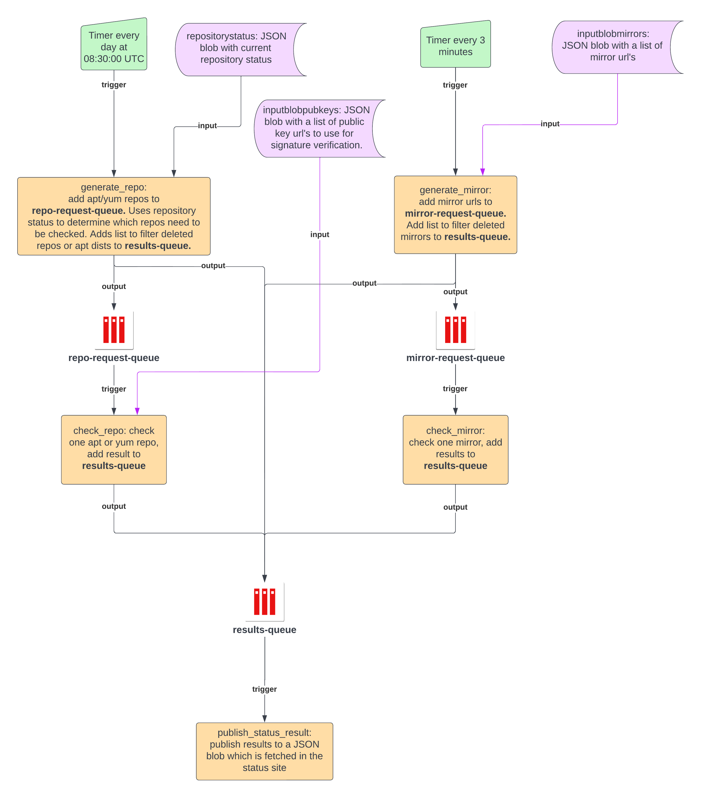

# Azure Functions backend for status checking

Azure functions are used to automate checking the publishing the status of PMC mirrors and repositories. PMC status checking uses three **function apps** each with multiple **functions**. Functions are spread across different function apps since each group of functions requires different configurations. 

## Summary of function apps

### **pmc_scan_mirrors**

Scans all of the PMC mirrors and is triggered by a timer every 3 minutes. Results are added to the results-queue (an Azure storage queue) which triggers a function in **pmc_status_delivery** to publish the results.

### **pmc_scan_repos**
Scans all apt and yum repositories and is triggered by a timer once a day. Results are added to the results-queue which triggers a function in **pmc_status_delivery** to publish the results.

### **pmc_status_delivery**
The one function in this app is triggered by messages added to the results-queue. Publishes mirror and repository status to a JSON blob which is then read by the website. 

## Key factors driving design

1. **pmc_scan_mirrors** and **pmc_scan_repos** perform trivially parallelizable actions.

2. Concurrency and queue settings are controlled on a per function app basis.

2. Scale-up/scale-down of mirror scan and repo scan can be significant and should be independent.

3. **pmc_status_delivery** actions involve blob leases that may face high contention; serializing update processing reduces latency and chance of starvation.


4. repo scan function requires the app be run under a premium (higher cost) plan to enable long runtimes past 10 minutes.

5. Functions with short runtimes, like those in **pmc_scan_mirrors**, can be starved if run in the same app as long runtime functions, especially if scale-up of the app is constrained.

6. repoaudit supports scanning a repository/distribution and not a single package. 

## Diagram of functions



## Deploy changes to functions

Make sure you are using a machine with at least Python 3.9. Setting up a virtual environment is recommended. 

1. Install [Azure Cli](https://docs.microsoft.com/en-us/cli/azure/install-azure-cli-linux) and login

2. Set default subscription to production subscription

    ```
    az account set --subscription <name or id>
    ```

3. Install npm

4. Install Azure Functions command line tool

    ```
    npm install -g azure-functions-core-tools@4 --unsafe-perm true
    ```

5. cd into function app folder

    ```
    cd <functionapp>
    ```

6. Deploy function app in Azure subscription

    ```
    func azure functionapp publish <functionappname in Azure subscription> --python
    ```

To deploy pmc_scan_repos with a custom repoaudit module, follow the steps in its [readme](pmc_scan_repos/README.md).